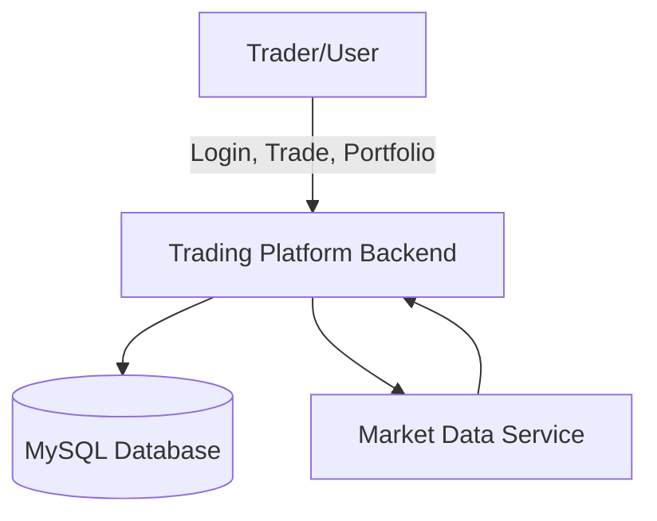
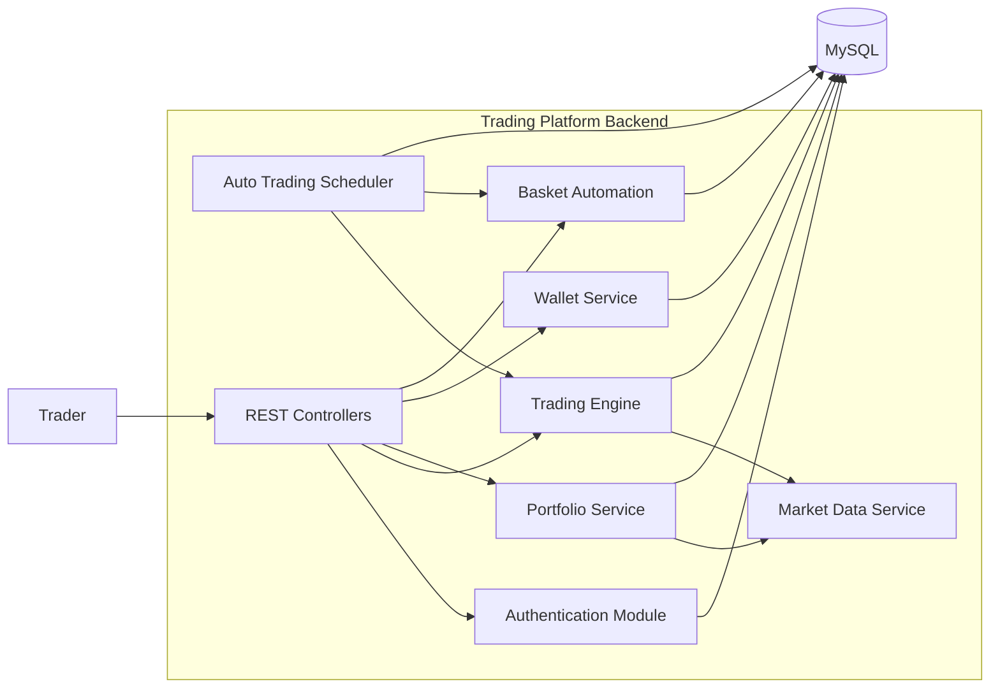
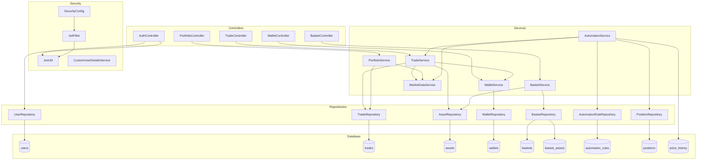
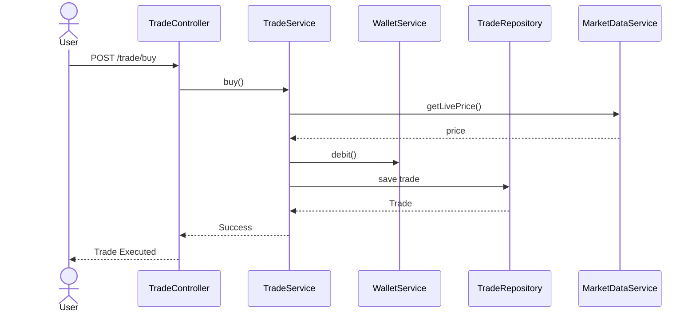
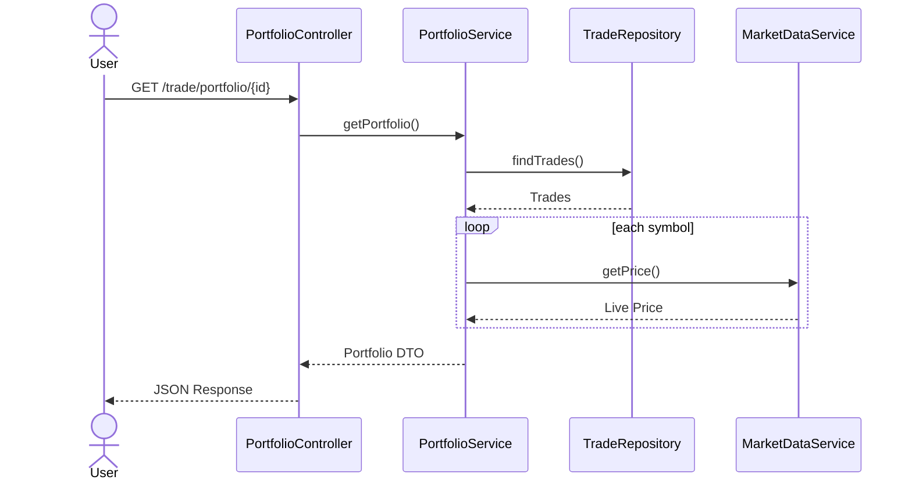
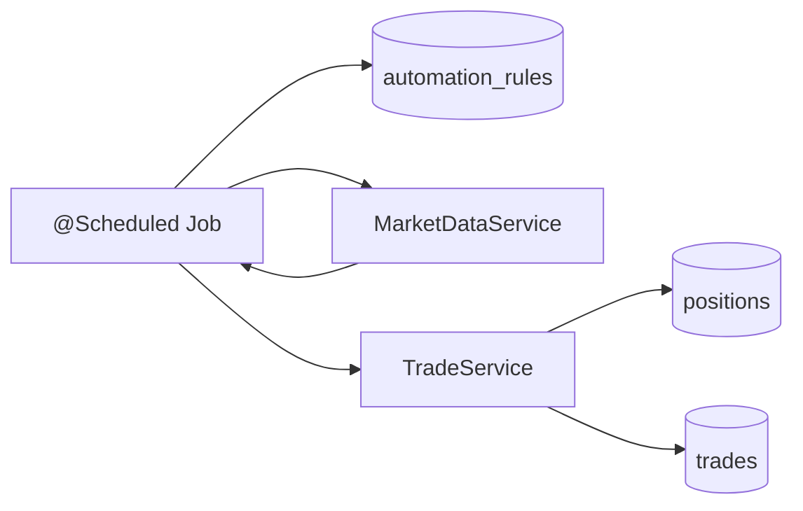

# Trading Platform Backend

## Overview

A Spring Boot based paper-trading platform that supports:

* User management
* Asset management
* Buy/Sell trading
* Portfolio tracking
* Wallet management
* Automation rules
* Basket management
* Basket automation
* Scheduled execution

---

## Architecture

User
↓
Wallet
↓
Trade Service
↓
Portfolio
↓
Automation
↓
Basket Automation

---

## Database Tables

### users

Stores platform users.

Fields:

* id
* username
* email
* password_hash

---

### assets

Stores tradable assets.

Fields:

* id
* symbol
* name
* market
* price

Examples:

* AAPL
* MSFT
* GOOGL

---

### wallets

Stores paper trading balances.

Fields:

* id
* user_id
* balance

---

### trades

Stores executed trades.

Fields:

* id
* user_id
* asset_id
* quantity
* price
* type
* timestamp

Types:

* BUY
* SELL

---

### automation_rules

Single-stock automation rules.

Example:

IF AAPL < 320
BUY 2

Fields:

* id
* user_id
* symbol
* condition_type
* threshold
* action_type
* quantity
* active

---

### baskets

User-created stock groups.

Example:

Tech Basket

Fields:

* id
* user_id
* name

---

### basket_assets

Assets belonging to a basket.

Fields:

* id
* basket_id
* asset_id
* condition_type
* threshold
* quantity
* active

Example:

AAPL LESS_THAN 300 BUY 2

MSFT LESS_THAN 450 BUY 1

GOOGL LESS_THAN 180 BUY 3

---

## Endpoints

### Assets

GET /asset

Returns all assets.

---

### Wallet

GET /wallet/{userId}

Returns wallet balance.

---

### Trades

POST /trade/buy

POST /trade/sell

GET /trade/transactions/{userId}

GET /trade/portfolio/{userId}

---

### Automation

POST /automation

Create rule.

GET /automation

List rules.

POST /automation/run

Execute rules immediately.

---

### Basket

POST /basket

Create basket.

POST /basket/{basketId}/asset

Add asset.

GET /basket/{basketId}

Get basket.

DELETE /basket/{basketId}/asset

Remove asset.

GET /basket/{basketId}/valuation

Basket valuation.

---

### Basket Automation

POST /basket-automation/{basketId}/run

Execute basket rules.

---

## Portfolio Calculation

Portfolio aggregates all BUY and SELL trades.

Outputs:

* Symbol
* Quantity
* Average Price
* Current Price
* Profit / Loss

---

## Current Project Status

Completed:

✓ Users

✓ Assets

✓ Wallet

✓ Paper Trading

✓ Buy

✓ Sell

✓ Transactions

✓ Portfolio

✓ Automation Rules

✓ Scheduler

✓ Basket Management

✓ Basket Valuation

✓ Basket Automation

Planned:

* Cooldown Rules
* Strategy Engine
* RSI Indicator
* EMA Indicator
* Backtesting
* JWT Authentication
* React Dashboard
* Broker Integrations
* WebSocket Live Prices

## Data Base
# Trading Platform Backend Architecture (C4 Style)

## System Context

---

## Container Diagram

---

## Component Diagram

---

## Trade Execution Flow

---

## Portfolio Calculation Flow

---

## Automation Scheduler Flow

## flowchart TD

%% =========================
%% CLIENT LAYER
%% =========================

User[User / Frontend]

User --> AuthController
User --> TradeController
User --> BasketController
User --> AutomationController
User --> WalletController

%% =========================
%% SECURITY LAYER
%% =========================

AuthController --> JwtUtil
JwtFilter --> JwtUtil

SecurityConfig --> JwtFilter

%% =========================
%% AUTH MODULE
%% =========================

AuthController --> UserRepository
AuthController --> PasswordEncoder

UserRepository --> User

%% =========================
%% TRADING MODULE
%% =========================

TradeController --> TradeService

TradeService --> TradeRepository
TradeService --> UserRepository
TradeService --> AssetRepository
TradeService --> WalletService

TradeRepository --> Trade
AssetRepository --> Asset
UserRepository --> User

Trade --> User
Trade --> Asset

%% =========================
%% PORTFOLIO ENGINE
%% =========================

TradeService --> PortfolioDTO

PortfolioDTO[
PortfolioDTO

* symbol
* quantity
* avgPrice
* currentPrice
* pnl
* realizedPnl
* unrealizedPnl
  ]

%% =========================
%% MARKET DATA
%% =========================

MarketPriceService --> AssetRepository

%% =========================
%% WALLET MODULE
%% =========================

WalletController --> WalletService

WalletService --> WalletRepository

WalletRepository --> Wallet

Wallet --> User

%% =========================
%% AUTOMATION ENGINE
%% =========================

AutomationController --> AutomationService

AutomationService --> AutomationRuleRepository
AutomationService --> MarketPriceService
AutomationService --> TradeService
AutomationService --> AssetRepository
AutomationService --> PriceHistoryService
AutomationService --> RSIIndicator
AutomationService --> EMAIndicator
AutomationService --> RuleEvaluator
AutomationService --> PositionRepository

AutomationRuleRepository --> AutomationRule
PositionRepository --> Position

AutomationRule --> User
Position --> User

%% =========================
%% INDICATORS
%% =========================

PriceHistoryService --> PriceHistoryRepository

PriceHistoryRepository --> PriceHistory

RSIIndicator --> PriceHistoryService
EMAIndicator --> PriceHistoryService

%% =========================
%% BASKET AUTOMATION
%% =========================

BasketController --> BasketAutomationService

BasketAutomationService --> BasketRepository
BasketAutomationService --> BasketAssetRepository
BasketAutomationService --> MarketPriceService
BasketAutomationService --> TradeService

BasketRepository --> Basket
BasketAssetRepository --> BasketAsset

Basket --> User

Basket --> BasketAsset

BasketAsset --> Asset

%% =========================
%% POSITION MONITORING
%% =========================

PositionMonitorService --> PositionRepository
PositionMonitorService --> MarketPriceService
PositionMonitorService --> TradeService

%% =========================
%% DATABASE
%% =========================

TradeRepository --> DB[(MySQL)]

UserRepository --> DB

AssetRepository --> DB

WalletRepository --> DB

AutomationRuleRepository --> DB

PositionRepository --> DB

BasketRepository --> DB

BasketAssetRepository --> DB

PriceHistoryRepository --> DB

%% =========================
%% SCHEDULERS
%% =========================

AutomationScheduler --> AutomationService

BasketScheduler --> BasketAutomationService

PriceHistoryScheduler --> PriceHistoryService

PositionMonitorScheduler --> PositionMonitorService

%% =========================
%% MAIN BUSINESS FLOW
%% =========================

User -->|Login| AuthController

AuthController --> JwtUtil

JwtUtil -->|JWT Token| User

User -->|Authenticated Request| JwtFilter

JwtFilter --> TradeController

TradeController --> TradeService

TradeService --> TradeRepository

TradeRepository --> DB

TradeService --> WalletService

WalletService --> WalletRepository

WalletRepository --> DB

%% =========================
%% AUTO TRADING FLOW
%% =========================

AutomationScheduler --> AutomationService

AutomationService --> MarketPriceService

AutomationService --> RSIIndicator

AutomationService --> EMAIndicator

AutomationService --> RuleEvaluator

AutomationService --> TradeService

TradeService --> TradeRepository

%% =========================
%% BASKET FLOW
%% =========================

BasketScheduler --> BasketAutomationService

BasketAutomationService --> MarketPriceService

BasketAutomationService --> TradeService

%% =========================
%% PORTFOLIO FLOW
%% =========================

TradeService --> PortfolioDTO

PortfolioDTO --> User
